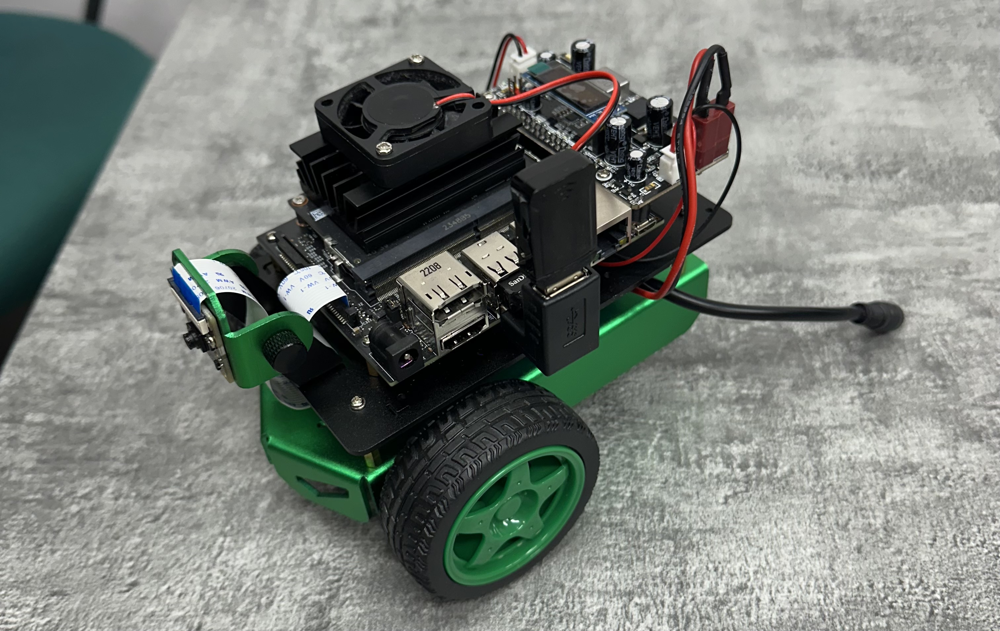
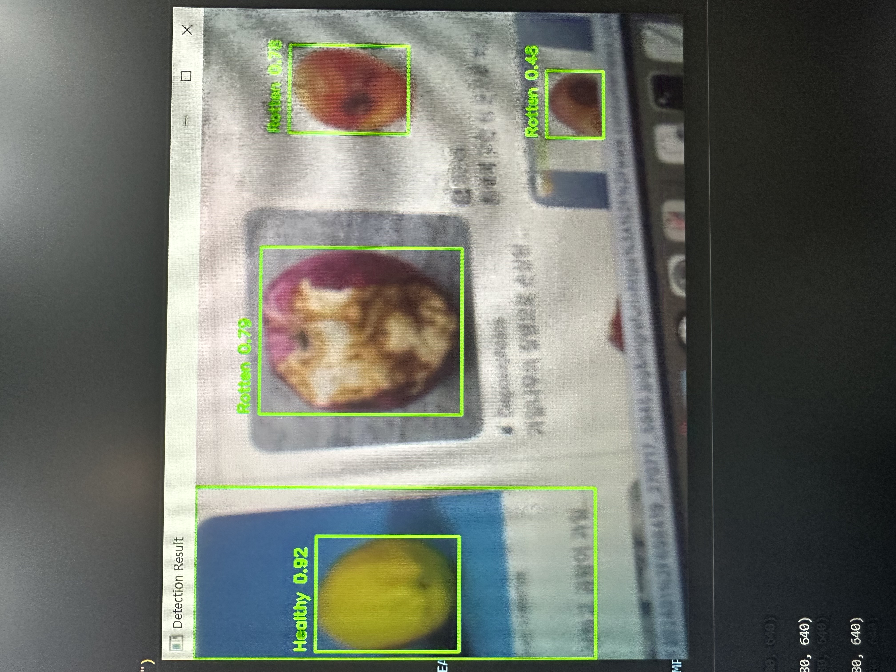

# Jetbot Mini



이 젯봇 미니 프로젝트는 다음과 같은 기능이 있습니다.
- 젯봇 미니 카메라로부터 실시간 영상을 스트리밍 합니다.
- 파란색 선을 따라 라인자율주행을 합니다.
- QR Code를 보고 인식합니다.
- 특정 이벤트 발생 시 부저를 울립니다.
- 키 입력으로 수동주행을 합니다.
- 좌,우 속도 조절이 가능합니다. (0~100%)
- YOLO 모델 기반으로 과일, 교통 표지판, 사람을 검출합니다.

## 프로젝트 목적
이 프로젝트는 NVIDIA Jetson Nano 플랫폼을 활용하여 복잡한 과일 도매시장에서 원하는 과일의 위치를 찾아주고 신선도를 결정합니다.

## 기대효과
도매시장뿐만 아니라 물류창고, 공장, 올리브영과 같은 다양한 물건이 존재하는 곳에서 물건의 위치를 찾아주고 재고관리에 도움을 줍니다.

## 시연
과일을 검출하고 신선도를 분류합니다.



QR코드를 보고 멈췄다 다시 갑니다.


파란색 LED를 깜빡입니다.


## 사용방법
하드웨어 요구사항
- Jetbot Mini
- NVIDIA Jetson Nano (2GB)
- Raspberry Pi Camera 모듈

소프트웨어 요구사항
- 운영체제: Ubuntu 18.04 / 20.04 (JetPack 기반)
- ROS (Robot Operating System) 설치 필요
- Python 3.6 이상

### LXTerminal 명령어 (in ROS)
```bash
# 1. 노드간 연결하는 기초 명령어
roscore 

# 2. 다른 웹 서버와 9090포트로 연결
roslaunch rosbridge_server rosbridge_websocket.launch

# 3. 카메라 활성화
roslaunch jetbot_ros opencv_apps.launch

# 4. usb 카메라 활성화 (usb 카메라 사용시에만)
roslaunch usb_cam usb_cam-test.launch

# 5. 실시간 영상 서버
rosrun web_video_server web_video_server

# 6. 코드 실행
rosrun coubot.py
```

## 버전 로그
- v1.0 (2025-02-14) : ROS와 관제PC를 JavaScript를 이용하여 JSON형식으로 통신한다 (실시간 영상, Topic, Service)
- v1.1 (2025-02-21) : 이미지 전처리와 자율주행 알고리즘으로 라인자율주행 구현
- v1.2 (2025-02-28) : Buzzer울리기, 속도 조절 & 수동 주행
- v1.3 (2025-03-07) : QR Code 인식

## 기술 스택
- 프로그래밍 언어: Python, JavaScript
- ROS (Robot Operating System): ROS Melodic
- 컴퓨터 비전: OpenCV
- 하드웨어: NVIDIA Jetson Nano, Jetbot Mini